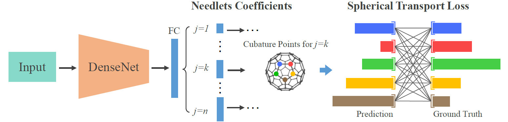
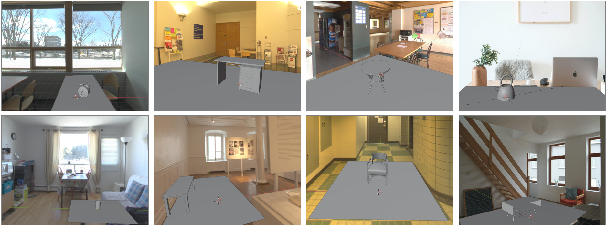

# EMLight: Lighting Estimation via Spherical Distribution Approximation (AAAI 2021)


## Update
Our new work [Sparse Needlets for Lighting Estimation with Spherical Transport Loss](https://openaccess.thecvf.com/content/ICCV2021/papers/Zhan_Sparse_Needlets_for_Lighting_Estimation_With_Spherical_Transport_Loss_ICCV_2021_paper.pdf) is accepted to ICCV 2021. This work introduces a new Needlets basis for lighting representation which allows to represent illumination in both spatial and frequency domains. The implementation code is available in `Needlets/` of this repository.




## Prerequisites
- Linux or macOS
- Python3, PyTorch
- CPU or NVIDIA GPU + CUDA CuDNN

## Dataset Preparation
[Laval Indoor HDR Dataset](http://indoor.hdrdb.com/#intro) <br>
Thanks to the intellectual property of Laval Indoor dataset, the original datasets and processed training data can not be released from me. Please get access to the dataset by contacting the dataset creator jflalonde@gel.ulaval.ca.

After getting the dataset, the raw illumination map can be processed to generate the training data of the regression network as below:
````bash
cd RegressionNetwork/representation/
python3 distribution_representation.py
````


## Pretrained Models
The pretrained regression model of EMLight (96 anchor points, without depth branch) as well as pretrained densenet-121 can be downloaded from [Google Drive](https://drive.google.com/file/d/1ziqu_hgmGzYXTQLQJPsS1AWLcVJWKzTN/view?usp=sharing). Saving the pretrained models in `RegressionNetwork/checkpoints`. The model parameters  should be adjusted accordingly for inference.

## Training
Then run the command 
````bash
cd RegressionNetwork/
python3 train.py
````
Training tip: you may overfit the model on a small subset first, then train the model on the full set, to avoid divergence during training.

## 3D Object Insertion & Rendering
To evaluate the performance of lighting estimation, we create an evaluation set with 25 scenes to conduct 3D object insertion & rendering (in Blender).
This evaluation dataset can be downloaded from [Google Drive](https://drive.google.com/file/d/1wSSfTd08Us8ccn5H88X6MyeEhlDfiONH/view?usp=sharing).




### Citation
If you use this code for your research, please cite our papers.
```
@inproceedings{zhan2021emlight,
  title={EMLight: Lighting Estimation via Spherical Distribution Approximation},
  author={Zhan, Fangneng and Zhang, Changgong and Yu, Yingchen and Chang, Yuan and Lu, Shijian and Ma, Feiying and Xie, Xuansong},
  booktitle={Proceedings of the AAAI Conference on Artificial Intelligence},
  year={2021}
}
```

```
@inproceedings{zhan2021emlight,
  title={Sparse Needlets for Lighting Estimation with Spherical Transport Loss},
  author={Zhan, Fangneng and Zhang, Changgong and Hu, Wenbo and Lu, Shijian and Ma, Feiying and Xie, Xuansong and Shao, Ling},
  booktitle={Proceedings of the IEEE International Conference on Computer Vision},
  year={2021}
}
```
